# Concept

TODO

# Current Status

The application is still under development. So far, only a few experiments were conducted:

## Predict a Segment in a MFCC
1. Different waveforms from
   the [SPEECHCOMMANDS](https://pytorch.org/audio/stable/_modules/torchaudio/datasets/speechcommands.html) dataset are
   loaded. One command in the dataset is a men who says "eight":
   

      
       
      <audio controls>
         <source src="assets/concept/waveform.wav" type="audio/wav">
      </audio>
   

2. From this signal, the MFCC is calculated:
   

      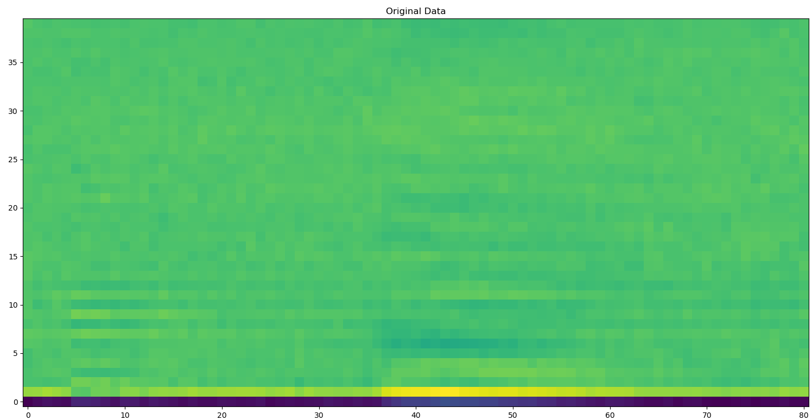
       
      <audio controls>
         <source src="assets/concept/MFCC.wav" type="audio/wav">
      </audio>
   

2. Then a part of the signal is masked (e.g. an area in the center is set to 0):
   

      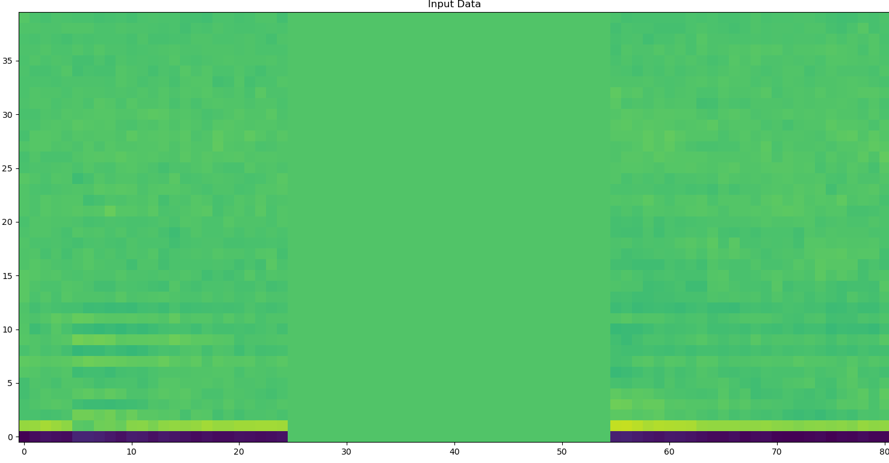
       
      <audio controls>
         <source src="assets/concept/MFCC_masked.wav" type="audio/wav">
      </audio>
   

3. This masked signal is fed into a transformer network which was trained to predict the masked part. If the (masked)
   input signal is composed with the prediction, the signal can be reconstructed (the masked part of the signal is
   replaced with the prediction from the transformer network):
   

      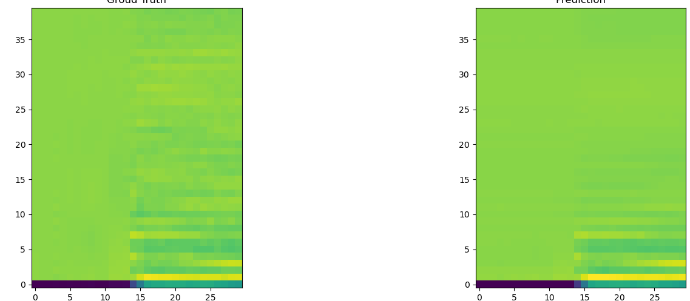
       
      <i>On the left the groud truth mask, on the right the predicted mask from the network</i>
       
      <audio controls>
         <source src="assets/concept/MFCC_reconstructed.wav" type="audio/wav">
      </audio>
       
       
      <i>This is the MFCC signal, predicted by the network.</i>
   

   
## Predict Different Number of Frames
At the end of an MFCC, $$k$$ frames were omitted. Then, a transformer network was trained to predict the missing $$k$$ frames.

Different Input-Data:

| $$k=1$$ | $$k=5$$ | $$k=10$$ |
|---------|---------|----------|
| 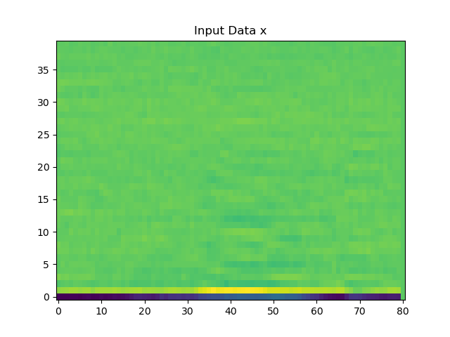 | 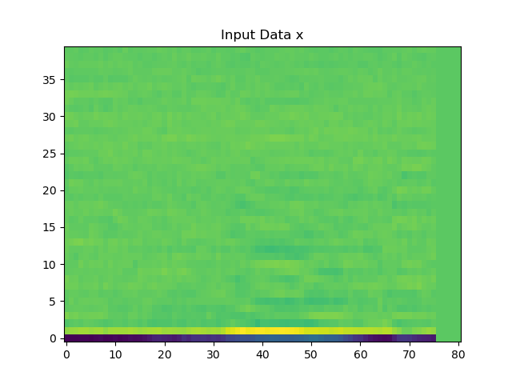 |  |

 ...

| $$k=50$$ | $$k=60$$ | $$k=70$$ |
|----------|----------|----------|
| 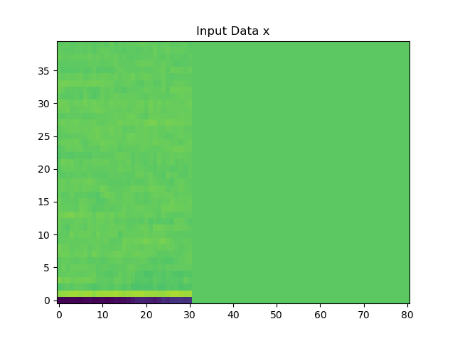 |  | 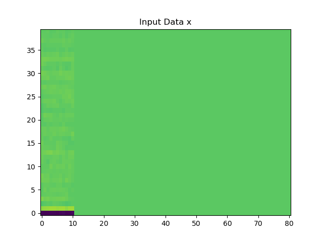 |

The error tends to be slightly larger when more frames are masked (larger $$k$$). However, this is not true in all cases and the difference is relatively small.

###### Error per Epoch for Runs with different k

| MAE | MSE |
|-----|-----|
| 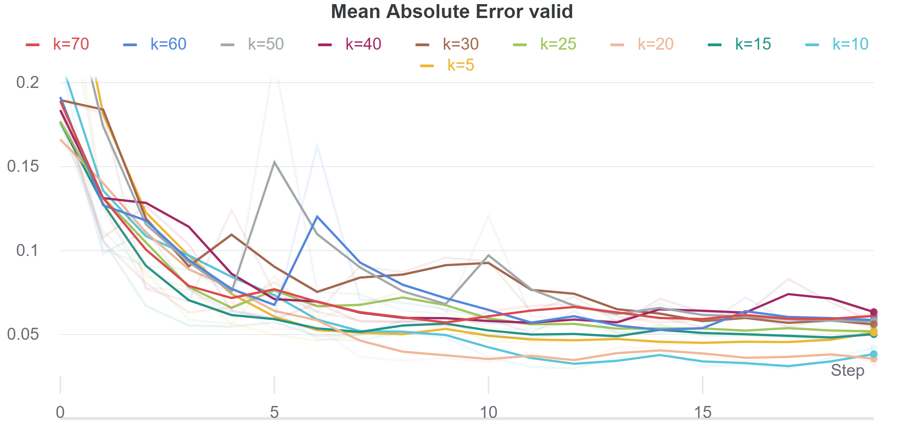 | 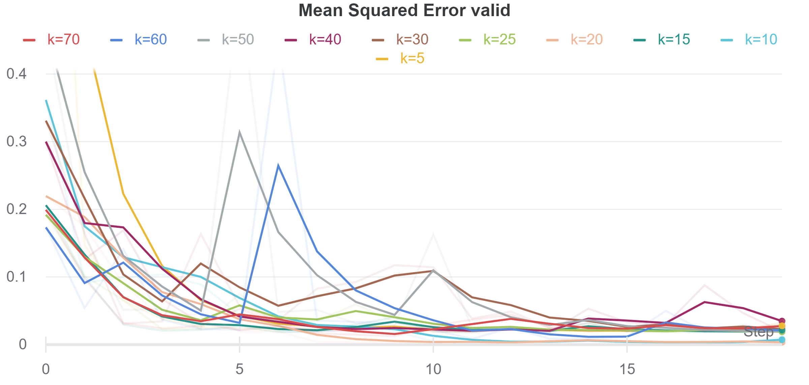 | 

###### Standard Deviation per Epoch for Runs with different k

| MAE | MSE |
|-----|-----|
| 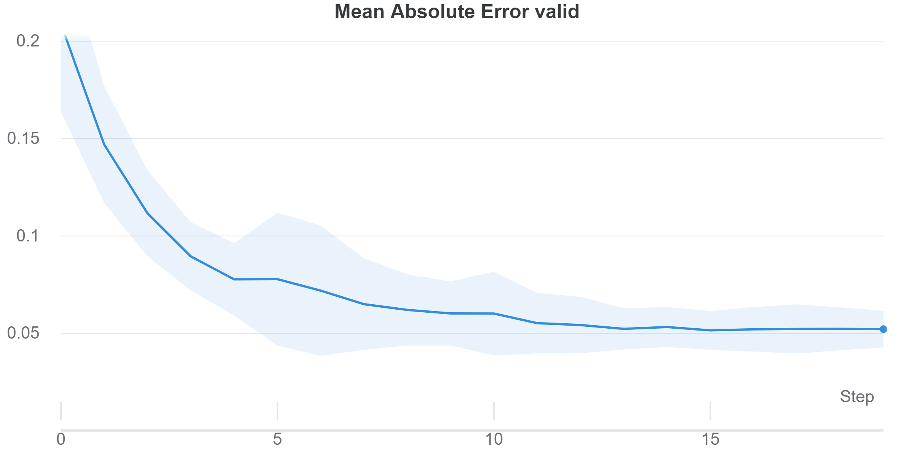 | 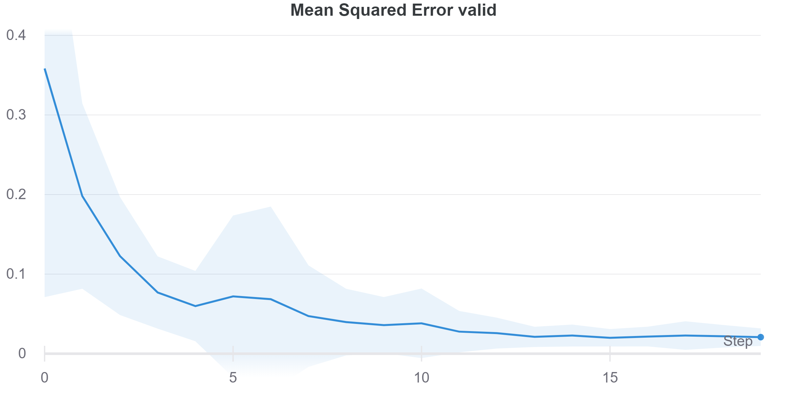 | 

