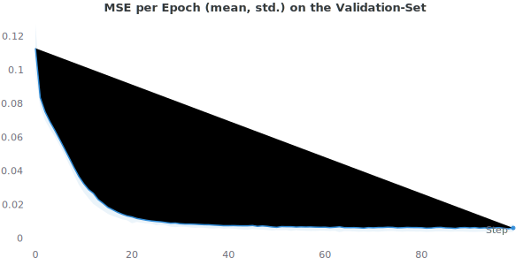
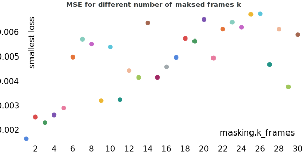
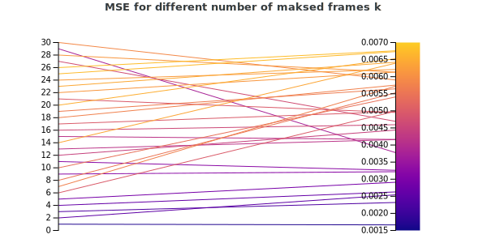
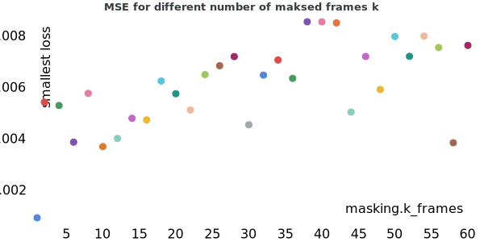
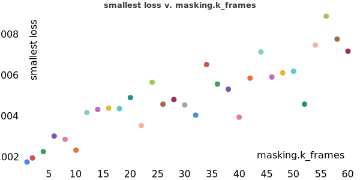
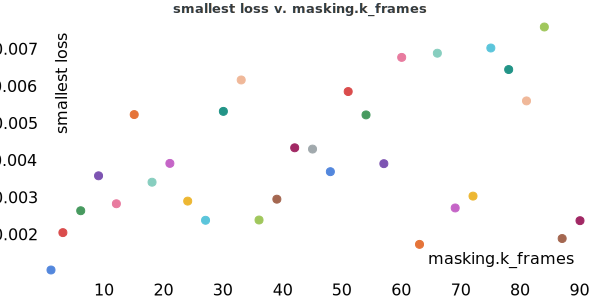
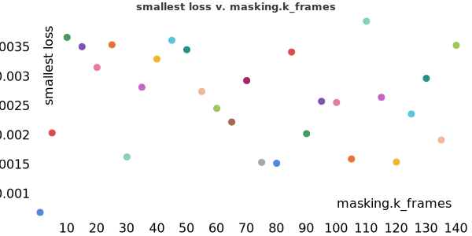
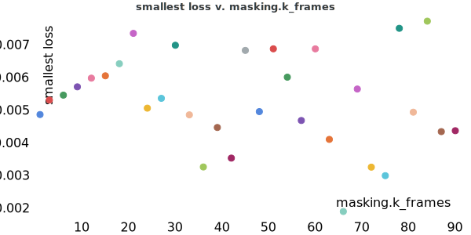
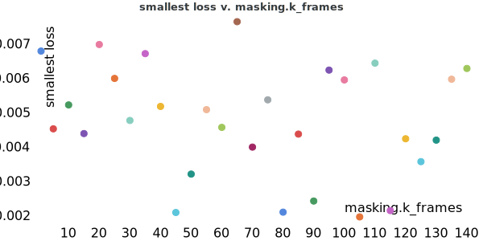

# Results

## TIMIT

### Parameters $$n$$ & $$k$$
The choice of the parameters $$n$$ and $$k$$ is very important. As Ref. [1] described, larger $$n$$ often lead to better results. 
However, the TIMIT data set contains rather short audio sequences ($$\approx 3s $$) and therefore the parameter $$nn$$ cannot be arbitrarily large. 
Figure 1 shows the different number of MFCC frames per audio file:

      
       
      <i> Figure 1: Number of MFCC frames per file</i>

In order to have enough data for training, $$n + k$$ should not be longer than $$\approx 150$$ frames.
Thus, the following constraint applies:

The chapter [concept]({{ site.baseurl }}) describes, that one word corresponds to $$30$$ frames.
This means that $$n + k$$ frames together consists of approx. 5 words.

[1] Dumbali and Nagaraja, "Real Time Word Prediction Using N-Grams Model", 2019, International Journal of Innovative Technology and Exploring Engineering (IJITEE)

### Simple Baseline

### Experiment 1: $$n=120$$, $$k=[1, 2, ..., 30]$$ and $$s=n+k$$

In this first experiment, $$n=120$$ frames were given and then the $$k$$ subsequent frames were predicted. Thereby $$k$$ 
was increased linearly from $$k=1$$ to $$k=30$$. The window-shift $$s$$ was defined as $$s=k+n$$. As a result, the models with a smaller $$k$$ could use more data during training.

| Mode | $$n_{frames}$$ | $$k_{frames}$$ | window shift $$s$$ | Dataset size |
|------|----------------|----------------|--------------------|--------------|
| End (TIMT) | $$120$$        | $$1,2,3, ..., 30$$ | $$n+k$$        | 4516($$k=30$$) to 6001 ($$k=1$$) |

The 30 models were trained separately, because specific frames could be used in one model as given data `x` and in another model as data to be predicted `y`.
All models achieved convincing results and have a similar mean square error:

 

      
       
      <i>Average MSE per epoch over all runs on the validation set.</i>

 
Although there are some outliers, there could to be a linear relationship between the MSE and the $$k$$ frames to predict:

    
     
    <i>Mean Square Error for different models using a different number of masked frames k</i>
     
     
    
     
    <i>A different plot which indicates a linear relationship by showing the dependency between MSE and the number of masked frames k</i>

 

Since the results were quite good, another experiment with $$k=1...60$$ was conducted:

    
     
    <i>Mean Square Error for different models using a different number of masked frames k</i>

The results still show a relatively small MSE even with $$k=60$$. The model with $$k=40$$ had the largest loss 
$$MSE=0$$.0085. However, this loss is still very small and the result is still good.
This is demonstrated with the following audio files: The first file is the original sound, the second file is the 
MFCC extracted from the original sound, the third file is the masked MFCC that was fed into the network and the fourth 
file is the prediction of the network. The difference between the MFCC from the original audiofile (file 2) and the 
predicted MFCC (file 4) is difficult to hear:

    <audio controls>
        <source src="assets/results/exp1/waveform.wav" type="audio/wav">
    </audio>
     
    <i>Audiofile 1: The original sound (a woman says "John cleans shellfish for a living").</i>

    <audio controls>
        <source src="assets/results/exp1/MFCC.wav" type="audio/wav">
    </audio>
     
    <i>Audiofile 2: The MFCC extracted from the original sound and cut into the correct length of 160 frames (a woman says "John cleans shellfish for a liv").</i>

    <audio controls>
        <source src="assets/results/exp1/MFCC_masked.wav" type="audio/wav">
    </audio>
     
    <i>Audiofile 3: The first 120 frames of the MFCC, which were fed into the network  (a woman says "John cleans shellfish").</i>

    <audio controls>
        <source src="assets/results/exp1/MFCC_reconstructed.wav" type="audio/wav">
    </audio>
     
    <i>Audiofile 4: The first 120 frames of the MFCC, concatenated with the predicted 40 frames of the network ("John cleans shellfish" was given, "for a liv" was predicted).</i>

It would be interesting to conduct additional experiments to investigate how many frames can be predicted 
and whether the relationship between $$k$$ and MSE is linear or not. However, when using $$n=120$$ and $$k=60$$, the problem arises that 
$$n+k>150$$ and consequently only half as much data is available as with $$k=1$$. Therefore, further experiments with smaller $$n$$ were conducted and described below.

### Experiment 2: $$n=90$$, $$k=[1, 2, 4, 6, ..., 60]$$ and $$s=n+k$$
<!--
Is called exp6 in wandb!!!
-->
In the second experiment, $$n=90$$ frames were given and then the $$k$$ subsequent frames were predicted. Thereby 
$$k$$ was increased linearly from $$k=1$$ to $$k=60$$. Compared to the previous experiment, $$n$$ was reduced so 
that $$k$$ could be increased while still having sufficient data for training available.

| Mode | $$n_{frames}$$ | $$k_{frames}$$ | window shift $$s$$ | Dataset size |
|------|----------------|----------------|--------------------|--------------|
| End (TIMT) | $$90$$   | $$1, 2, 4, 6, ..., 60$$ | $$n+k$$     | 4516($$k=60$$) to 8724 ($$k=1$$) |

     
    
     
    <i>Mean Square Error for different models using a different number of masked frames k</i>

Even if fewer frames are given (i.e. $$n=90$$), very good results are still achieved. The loss is for all models still 
relatively small. In addition, the plot indicates a possible linear relationship between the number of masked frames 
$$k$$ and the MSE of the models.

### Experiment 3: $$n=60$$, $$k=[1, 3, 6, 9, ..., 90]$$ and $$s=n+k$$
<!--
Is called exp7 in wandb!!!
-->
In the third experiment, $$n=60$$ frames were given and then the $$k$$ subsequent frames were predicted. Thereby 
$$k$$ was increased linearly from $$k=1$$ to $$k=90$$. Compared to the previous experiment, $$n$$ was reduced even 
more so that $$k$$ could be increased again.

| Mode | $$n_{frames}$$ | $$k_{frames}$$ | window shift $$s$$ | Dataset size |
|------|----------------|----------------|--------------------|--------------|
| End (TIMT) | $$60$$   | $$1, 3, 6, 9, ..., 90$$ | $$n+k$$     | 4516 ($$k=90$$) to 13936 ($$k=1$$) |

     
    
     
    <i>Mean Square Error for different models using a different number of masked frames k</i>

In this experiment, compared to the previous one, the number of given frames $$n$$ was further reduced and the number 
of frames to be predicted was increased up to $$k=90$$. Surprisingly, the performance is still very good. The plot also 
questions the linear relationship between the number of masked frames and the MSE. Many models with a $$k>60$$ have 
achieved very good results.

### Experiment 4: $$n=10$$, $$k=[1, 5, 10, 15, ..., 140]$$ and $$s=n+k$$
<!--
Is called exp9 in wandb!!!
-->
This experiment was created to test the extreme case. Only very few frames were given, i.e. $$n=10$$, which 
corresponds to one third of a word. At the same time, a very large number of words had to be predicted, $$k_{max}=150$$ 
corresponds to about five words.

| Mode | $$n_{frames}$$ | $$k_{frames}$$ | window shift $$s$$ | Dataset size |
|------|----------------|----------------|--------------------|--------------|
| End (TIMT) | $$10$$   | $$1, 5, 10, 15, ..., 140$$ | $$n+k$$     | 4516 ($$k=140$$) to 86122 ($$k=1$$) |

     
    
     
    <i>Mean Square Error for different models using a different number of masked frames k</i>

This experiment shows that the Transformer network is probably capable of learning the sentences of TIMIT completely.
Moreover, the results are very good. There is no longer a linear relationship between the number of masked frames and 
the MSE. This confirms the thesis that the complete sentences and not only individual phonemes can be learned.

### Experiment 5: $$n=90$$, $$k=[1, 2, 4, 6, ..., 60]$$ and $$s=150$$
<!--
Is called exp3 in wandb!!!
-->
In the previous experiments, the window shift was defined as $$s=n+k$$. Thus, each model had a different number of 
training data. In addition, the given data `x` and the labels `y` were also different for each model. In the 
following, a uniform window shift s is used. This results in all models having the same amount of data and using 
the same MFCC sequences as input.

Otherwise the setup remains the same, $$n$$ frames are given again and the subsequent $$k$$ frames are predicted.

| Mode | $$n_{frames}$$ | $$k_{frames}$$ | window shift $$s$$ | Dataset size |
|------|----------------|----------------|--------------------|--------------|
| End (TIMT) | $$90$$   | $$1, 2, 4, 6, ..., 60$$ | $$150$$     | 4516 |

     
    
     
    <i>Mean Square Error for different models using a different number of masked frames k</i>

The fixed frame shift $$s$$ did not change the results much. This approach is probably not the best way to train a 
good model. However, it does make the comparison between the models more consistent, as all models have the same 
amount of training data and the same frames have to be predicted.

### Experiment 6: $$n=60$$, $$k=[1, 3, 6, 9, ..., 90]$$ and $$s=150$$
<!--
Is called exp8 in wandb!!!
-->
In this experiment, the windows-shift was again defined as $$s=150$$ so that all models have the same amount of data.
Compared to the previous experiment, $$n$$ was reduced so that $$k_{max}$$ could be increased.

| Mode | $$n_{frames}$$ | $$k_{frames}$$ | window shift $$s$$ | Dataset size |
|------|----------------|----------------|--------------------|--------------|
| End (TIMT) | $$60$$   | $$1, 3, 6, 9, ..., 90$$ | $$150$$     | 4516 |

     
    
     
    <i>Mean Square Error for different models using a different number of masked frames k</i>

In this case with fixed $$s$$, the models with small $$k$$ tended to get worse. However, this should be taken with 
caution. Only one run was done per model. It is very likely, that with more runs a better model could be trained. To 
get statistically more meaningful results, multiple runs should be executed and then the MSE should be averaged.
However, this experiments were more about to find a limit for the parameter $$k$$.

### Experiment 7: $$n=10$$, $$k=[1, 5, 10, 15, ..., 140]$$ and $$s=150$$
<!--
Is called exp10 in wandb!!!
-->
This experiment is another test of the extreme case. Only a very small number of frames were given (i.e. $$n=10$$), 
while a verly larger number of frames had to be predicted (i.e. $$k_{max}=140$$).
In this experiment, the windows-shift was again defined as $$s=150$$ so that all models have the same amount of data.
Compared to the previous experiment, $$n$$ was reduced so that $$k_{max}$$ could be increased.

| Mode | $$n_{frames}$$ | $$k_{frames}$$ | window shift $$s$$ | Dataset size |
|------|----------------|----------------|--------------------|--------------|
| End (TIMT) | $$10$$   | $$1, 5, 10, 15, ..., 140$$ | $$150$$     | 4516 |

     
    
     
    <i>Mean Square Error for different models using a different number of masked frames k</i>

The results are still very good in this experiment. The loss is small for all models. To show how good the results are, 
some results are made audible below.

| Original MFCC | Masked MFCC (Input) | Reconstructed MFCC (Prediction) |
|---------------|---------------------|---------------------------------|
| <audio controls><source src="assets/results/exp7/MFCC_1.wav" type="audio/wav"></audio> | <audio controls><source src="assets/results/exp7/MFCC_masked_1.wav" type="audio/wav"></audio> | <audio controls><source src="assets/results/exp7/MFCC_reconstructed_1.wav" type="audio/wav"></audio> |
| <audio controls><source src="assets/results/exp7/MFCC_2.wav" type="audio/wav"></audio> | <audio controls><source src="assets/results/exp7/MFCC_masked_2.wav" type="audio/wav"></audio> | <audio controls><source src="assets/results/exp7/MFCC_reconstructed_2.wav" type="audio/wav"></audio> |
| <audio controls><source src="assets/results/exp7/MFCC_3.wav" type="audio/wav"></audio> | <audio controls><source src="assets/results/exp7/MFCC_masked_3.wav" type="audio/wav"></audio> | <audio controls><source src="assets/results/exp7/MFCC_reconstructed_3.wav" type="audio/wav"></audio> |
| <audio controls><source src="assets/results/exp7/MFCC_4.wav" type="audio/wav"></audio> | <audio controls><source src="assets/results/exp7/MFCC_masked_4.wav" type="audio/wav"></audio> | <audio controls><source src="assets/results/exp7/MFCC_reconstructed_4.wav" type="audio/wav"></audio> |

