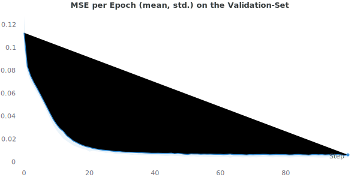
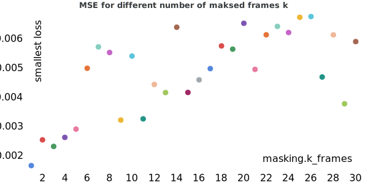
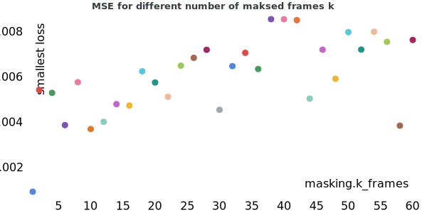

# Results

## TIMIT

### Parameters $$n$$ & $$k$$
The choice of the parameters $$n$$ and $$k$$ is very important. As Ref. [1] described, larger $$n$$ often lead to better results. 
However, the TIMIT data set contains rather short audio sequences ($$\approx 3s $$) and therefore the parameter $$nn$$ cannot be arbitrarily large. 
Figure 1 shows the different MFCC lengths:

      
       
      <i> Figure 1: MFCC frame lengths</i>

In order to have enough data for training, $$n + k$$ should not be longer than $$\approx 150$$ frames.
Thus, the following constraint applies:

The chapter [concept]({{ site.baseurl }}) describes, that one word corresponds to $$30$$ frames.
This means that $$n + k$$ frames together consists of approx. 5 words.

[1] Dumbali and Nagaraja, "Real Time Word Prediction Using N-Grams Model", 2019, International Journal of Innovative Technology and Exploring Engineering (IJITEE)

## Experiment 1

In this first experiment, $$n=120$$ frames were given and then the $$k$$ subsequent frames were predicted. Thereby $$k$$ 
was increased linearly from $$k=1$$ to $$k=30$$. The window-shift $$s$$ was defined as $$s=k+n$$. As a result, the models with a smaller $$k$$ could use more data during training.

| Mode | $$n_{frames}$$ | $$k_{frames}$$ | window shift $$s$$ | Dataset size |
|------|----------------|----------------|--------------------|--------------|
| End (TIMT) | $$120$$        | $$1,2,3, ..., 30$$ | $$n+k$$        | 4516($$n=30$$) to 6001 ($$n=1$$) |

The 30 models were trained separately, because specific frames could be used in one model as given data `x` and in another model as data to be predicted `y`.
All models achieved convincing results and have a similar mean square error:

 

      
       
      <i>Average MSE per epoch over all runs on the validation set.</i>

 
Although there are some outliers, there could to be a linear relationship between the MSE and the $$k$$ frames to predict:

    
    

 

Since the results were quite good, another experiment with $$k=1...60$$ was conducted:

    

The results still show a relatively small MSE even with $$k=60$$. It would be interesting to conduct additional experiments to investigate how many frames can be predicted 
and whether the relationship between $$k$$ and MSE is linear or not. However, when using $$n=120$$ and $$k=60$$, the problem arises that 
$$n+k>150$$ and consequently only half as much data is available as with $$k=1$$. Therefore, further experiments with smaller $$n$$ were conducted and described below.