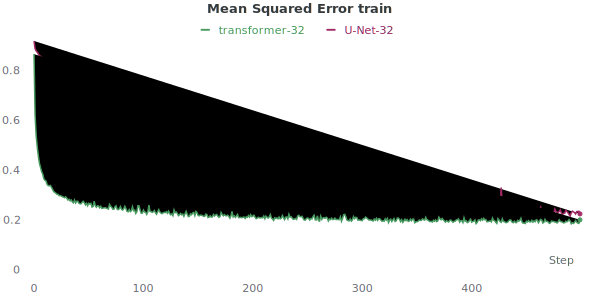

# Results

## TIMIT

### Parameters $$n$$ & $$k$$
The choice of the parameters $$n$$ and $$k$$ is very important. As Ref. [1] described, larger $$n$$ often lead to better results. 
However, the TIMIT data set contains rather short audio sequences ($$\approx 3s $$) and therefore the parameter $$nn$$ cannot be arbitrarily large. 
Figure 1 shows the different number of MFCC frames per audio file:

      
       
      <i> Figure 1: Number of MFCC frames per file</i>

In order to have enough data for training, $$n + k$$ should not be longer than $$\approx 150$$ frames.
Thus, the following constraint applies:

$$
s = n + k_{max} \leq 150
$$

The chapter [concept]({{ site.baseurl }}) describes, that one word corresponds to $$30$$ frames.
This means that $$n + k$$ frames together consists of approx. 5 words.

[1] Dumbali and Nagaraja, "Real Time Word Prediction Using N-Grams Model", 2019, International Journal of Innovative Technology and Exploring Engineering (IJITEE)

### Simple Baseline MFCC
The goal is to predict the $$k$$ following frames for $$n$$ given frames. In order to estimate in which range an MSE from a working network should lie, two simple baselines are defined:

- *Mean of previous $$n$$ frames:* The average value on the time axis of the $$k$$ given frames is calculated. This mean value is then used as prediction for all of the following $$k$$ values. 
- *Last given frame:* The last given frame is used as prediction for all of the following $$n$$ values. This prediction is fairly good for the first frame, but quickly becomes inaccurate for predictions further away

      
       
      <i> Figure 2: The average value as prediction has a constant MSE of about 0.14. The last value, on the other hand, achieves a small MSE for the first few frames, but the MSE increases rapidly thereafter.</i>

A well-working neural network should be able to achieve better results than these baselines. This means that the MSE of the network should be smaller and in the lower right quadrant of the graph shown in figure 2.

### Baseline Network for Mel-Spectrogram
This repository mainly investigates the prediction of MFCC frames. However, in order to create a simple baseline with computer vision methods, Mel-Spectrograms were also used. The features of Mel-Spectrograms are highly dependent and therefore easier to predict with computer vision methods. Thereby, the principle is identical to the prediction of MFCCs, as shown in Figure 3.

      
       
      <i> Figure 3: A given Mel-Spectrogram (upper plot) is split into two sub-spectrograms: The first n frames are used as input data x (lower left) and the following k frames have to be predicted by the network (lower right).</i>

The same baselines were calculated for the Mel-Spectrogram as done for the MFCC: The average value of the previous $$n$$ frames and the last given frame were used as prediction for the following $$k$$ frames. A neural network should be able to outperform these simple baseline approaches. 

As a first approach, a U-Net++ was implemented. The U-Net++ is very well proven and usually achieves good results. The network used is a slight modification compared to the original version: An Efficientnet-b0 was used as the encoder. In total, the encoder and the decoder have a depth of $$d=5$$ and at the end, a linear layer maps the calculated prediction to the correct length.

To make pooling simpler to implement, powers of two were used as the input length $$n$$. Since the segment length $$s_{max}$$ should be smaller than $$150$$ (i.e. $$s_{max} \leq 150$$), $$n=64$$ frames were used as input. Thus, more examples are available for training, but less context is available (shorter segments given).
Figure 4 shows that this U-Net++ implementation was able to outperform the two simple baselines.

      
       
      <i> Figure 4: The prediction of the U-Net++ was better than the two simple baselines. However, the plot also shows that the network is overfitting on the training data.</i>

If only one frame has to be predicted ($$k=1$$), then using the last given frame is considered a good prediction. This prediction has an average MSE of $$0.15$$. Therefore, predictions with a MSE $$\leq 0.15$$ are in general considered as good predictions. 
However, the U-Net++ achieves such results only for very short sequences. Moreover, the results are not satisfactory when viewed visually or acoustically, despite the small MSE.
Figure 5 shows the predicted Mel-Spectrogram of the U-Net on the training set. The MSE was xxxxxxxxxx and therefore below the threshold of $$0.15$$.
The plot indicates that this prediction was not good despite the low MSE. Instead of the network predicting phenomes, it learns to create a "noise" with a low MSE. This suggests that the MSE is not necessarily a suitable loss function. This is examined in more detail in the following section.

> TODO: add plot / sound -> U-Net snowy-snow-17 on Training set

      
       
      <i> Figure 7: Prediction of 8 frames of a Mel-Spectrogram, created with a U-Net++ on the training set</i>

##### Why it is Challenging
The TIMIT data set consists of different speakers saying the same sentences. Predicting the following words based on some given words would be easy if it would be text. This is because each word can be represented by a token. For audio files, however, this task is much more complex. A single word consists of several frames. In addition, each speaker pronounces the words differently (speed, pitch, glitches, pauses, mood, ...). Thus, the words cannot be represented by a token but by a 2D vector (features x time). 

A typical phrase from the TIMIT data set is "She had your dark suit in greasy wash water all year". The entire data set was searched for two speakers who pronounce this sentence as identically as possible (pitch and timing). In addition, the files were trimmed so that they are as identical as possible. Figure 6 shows the Mel-Spectrogram of these two audio files.

      
       
      <i> Figure 6: The Mel-Spectrograms of two men saying the sentence "She had your dark suit in greasy wash water all year" as similar as possible.</i>

The MSE between these two spectrograms is $$0.3917$$, which is not too bad. However, the result of this prediction sounds good acoustically and looks good visually as well. This is remarkable because the MSE is larger than when a model is used for prediction. Although the MSE is much smaller when a model is used for prediction, their result is visually and acoustically worse.
This indicated that the MSE is not necessarily a suitable metric for a loss function.

To confirm this, the whole procedure was repeated. Figure 7 shows two more Mel-Spectrograms, which match well optically. 

      
       
      <i> Figure 7: The Mel-Spectrograms of two women saying the sentence "She had your dark suit in greasy wash water all year" as similar as possible.</i>

These two spectrograms have an MSE of $$2.981$$. This is worse than simply taking the average of the previous frames as the prediction. 

These two tests show that the MSE only cannot really be used to infer quality. With the MSE, individual features of frames are compared. Thus it can happen that a relatively good prediction (i.e. a very similar sequence) has a much larger MSE than the prediction of a simple model (i.e. average value or U-Net). The MSE is larger, although the prediction is visually as well as acoustically better. This suggests that the MSE it not necessarily a good loss function.

##### Soft Dynamic Time Wrapping (Soft-DTW)
Soft-DTW [1] was used as an alternative loss function to MSE. Unlike the Euclidean distance, DTW can compare time series of variable size and is robust to shifts or dilatations across the time dimension.
Soft-DTW solves the soft minimal-cost alignment problem between two time series. Compared to DTW, soft-DTW has a regularizazion parameter $$\gamma$$.

The table below compares the MSE loss with the Soft-DTW loss for a prediction of $$k=32$$ frames. The first two columns contain the loss for the two baselines "Last Frame" and "Average". 
As shown in figure 4, using the average is the better baseline if $$k > 5$$ frames are predicted. 
The 3rd column shows the loss for the figure 6, if the second Mel-specotrgram is used as prediction for the first spectrogram, and the 4th column shows the same for the figure 7.

| Loss 32 Frames | Loss Last Frame | Loss Average | Loss Diff. Fig. 6 | Loss Diff. Fig. 7 |
|---------------|-----------------|--------------|-------------------|-------------------|
| MSE           | $$ 1.451 $$ | $$ 0.708 $$ | $$0.3917$$ $$(55.32%)$$ | $$2.981$$ $$(421%)$$ | 
| Soft-DTW $$\gamma=0.1$$ | $$5940$$ | $$2899$$ | $$1492.8$$ $$(51.49%)$$ | $$11269.1$$ $$(388.7%)$$  |
| Soft-DTW $$\gamma=1.0$$ | $$5912$$ | $$2878$$ | $$1466.2$$ $$(50.91%)$$ | $$11294.1$$ $$(392.4%)$$ |

The loss must be small for two very similar predictions. In order that the network cannot simply learn a simple baseline such as the average value, the loss must also be smaller than these baselines. This is the case for Figure 6: In the table, the brackets show how much larger the loss is compared to the better baseline. For Figure 7, however, this is far from being the case. This is considered as one of the difficulties of these predictions: If in this case the network only predicted the average, it would be much better. 

The table shows that the soft-DTW relaxes this problem a bit. However, neither this loss has yet brought a breakthrough and the predictions are still very poor (visually as well as acoustically), although the performance is better than the average value.

##### U-Net++ vs. Transformer
Another interesting comparison is the difference between the U-Net++ and a Transformer network. The Transformer network learns faster (i.e. training loss is reduced faster), but has a higher loss on the validation set as shown in figure 8.

    
    
     
    <i> Figure 8: The plot on the left shows the training loss (i.e. MSE) and the plot on the right the loss on the validation set. The Transformer network has a much steeper learning curve but overfits more than the U-Net++.</i>

- [1] Cuturi and Blondel, Soft-DTW: a Differentiable Loss Function for Time-Series, 2017, ICML