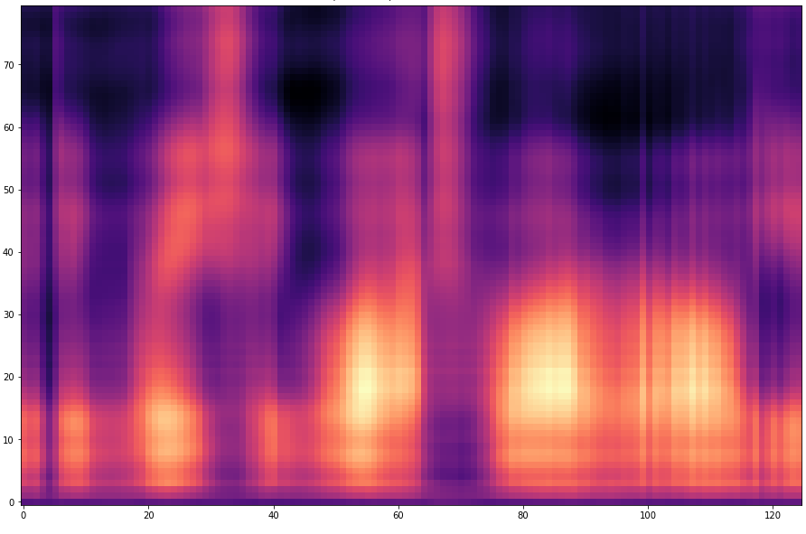

# Results

The audio files from the TIMIT dataset were converted to Mel-spectrograms. Fixed length segments were then extracted from these Mel-spectrograms using a sliding window. The segments were split into two parts: The first part was fed into the model and used to predict the second part of the segment.
This process is illustrated in below figure 2.

      
       
      <i> Figure 2: Concept of the trained network</i>

Some results are presented below. In these models, 120 frames were fed into the network and 25 frames were predicted.
After that, the sliding window was shifted forward by 1 frame and the process was repeated.
The 25 predicted frames correspond approximately to one word. However, the quality of the prediction is difficult to determine based on only one word. Therefore, several predictions were composed. 

The composition was done as follows: From a predicted sequence, the frame at the position `offset` was stored. Then the sliding window was moved shifted by 1 and the next frame at the position `offset` was saved.

The prediction becomes of course more difficult if the `offset` is larger. For example, with an `offset=25`, 24 frames must first be predicted and then only the 25th predicted frame is stored. With a smaller `offset` less frames have to be predicted and thus the task becomes easier.

The results are presented below. Only the ground truth and the prediction are shown in the table -> the segment that was fed into the network is not visible.

#### Speaker MRJM4, Sentence SA1

Ground truth audio (resynthesized Mel-spectrogram):

      <audio controls>
         <source src="assets/results/MRJM4-SA1/original.wav" type="audio/wav">
      </audio>

| `offset` | Ground Truth spectrogram | Predicted Spectrogram | Predicted Audio |
|----------|--------------------------|-----------------------|-----------------|
| 1        |  |  | <audio controls><source src="assets/results/MRJM4-SA1/1-ahead.wav" type="audio/wav"></audio> |
| 5        |  |  | <audio controls><source src="assets/results/MRJM4-SA1/5-ahead.wav" type="audio/wav"></audio> |
| 10       |  |  | <audio controls><source src="assets/results/MRJM4-SA1/10-ahead.wav" type="audio/wav"></audio> |
| 20       |  |  | <audio controls><source src="assets/results/MRJM4-SA1/20-ahead.wav" type="audio/wav"></audio> |
| 25       |  |  | <audio controls><source src="assets/results/MRJM4-SA1/25-ahead.wav" type="audio/wav"></audio> |

#### Speaker MJTH0, Sentence SA1 (Overfitted Model)

*This model overfitted on the test data - but is for some sentences (such as this one) particularly good*

Ground truth audio (resynthesized Mel-spectrogram):

      <audio controls>
         <source src="assets/results/MJTH0-SA1(overfitted)/original.wav" type="audio/wav">
      </audio>

| `offset` | Ground Truth spectrogram | Predicted Spectrogram | Predicted Audio |
|----------|--------------------------|-----------------------|-----------------|
| 1        |  |  | <audio controls><source src="assets/results/MJTH0-SA1(overfitted)/1-ahead.wav" type="audio/wav"></audio> |
| 5        |  |  | <audio controls><source src="assets/results/MJTH0-SA1(overfitted)/5-ahead.wav" type="audio/wav"></audio> |
| 10       |  |  | <audio controls><source src="assets/results/MJTH0-SA1(overfitted)/10-ahead.wav" type="audio/wav"></audio> |
| 20       |  |  | <audio controls><source src="assets/results/MJTH0-SA1(overfitted)/20-ahead.wav" type="audio/wav"></audio> |
| 25       |  |  | <audio controls><source src="assets/results/MJTH0-SA1(overfitted)/25-ahead.wav" type="audio/wav"></audio> |

#### Speaker MCHH0, Sentence SA2

Ground truth audio (resynthesized Mel-spectrogram):

      <audio controls>
         <source src="assets/results/MCHH0-SA2/original.wav" type="audio/wav">
      </audio>

| `offset` | Ground Truth spectrogram | Predicted Spectrogram | Predicted Audio |
|----------|--------------------------|-----------------------|-----------------|
| 1        |  |  | <audio controls><source src="assets/results/MCHH0-SA2/1-ahead.wav" type="audio/wav"></audio> |
| 5        |  |  | <audio controls><source src="assets/results/MCHH0-SA2/5-ahead.wav" type="audio/wav"></audio> |
| 10       |  |  | <audio controls><source src="assets/results/MCHH0-SA2/10-ahead.wav" type="audio/wav"></audio> |
| 20       |  |  | <audio controls><source src="assets/results/MCHH0-SA2/20-ahead.wav" type="audio/wav"></audio> |
| 25       |  |  | <audio controls><source src="assets/results/MCHH0-SA2/25-ahead.wav" type="audio/wav"></audio> |

#### Speaker FJLM0, Sentence SA2 (Overfitted Model)

*This model overfitted on the test data - but is for some sentences (such as this one) particularly good*

Ground truth audio (resynthesized Mel-spectrogram):

      <audio controls>
         <source src="assets/results/FJLM0-SA2(overfitted)/original.wav" type="audio/wav">
      </audio>

| `offset` | Ground Truth spectrogram | Predicted Spectrogram | Predicted Audio |
|----------|--------------------------|-----------------------|-----------------|
| 1        |  |  | <audio controls><source src="assets/results/FJLM0-SA2(overfitted)/1-ahead.wav" type="audio/wav"></audio> |
| 5        |  |  | <audio controls><source src="assets/results/FJLM0-SA2(overfitted)/5-ahead.wav" type="audio/wav"></audio> |
| 10       |  |  | <audio controls><source src="assets/results/FJLM0-SA2(overfitted)/10-ahead.wav" type="audio/wav"></audio> |
| 20       |  |  | <audio controls><source src="assets/results/FJLM0-SA2(overfitted)/20-ahead.wav" type="audio/wav"></audio> |
| 25       |  |  | <audio controls><source src="assets/results/FJLM0-SA2(overfitted)/25-ahead.wav" type="audio/wav"></audio> |

