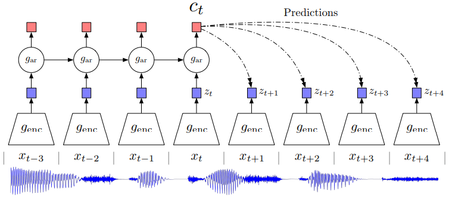
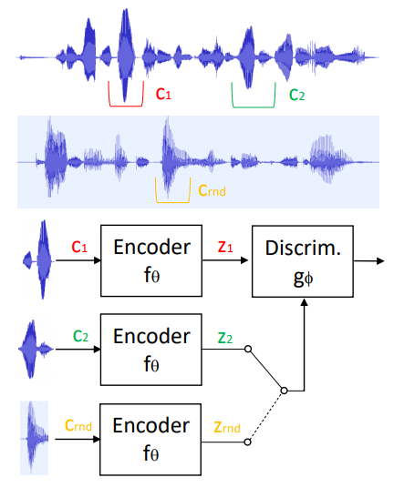
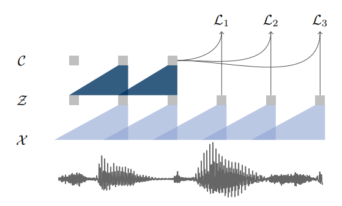
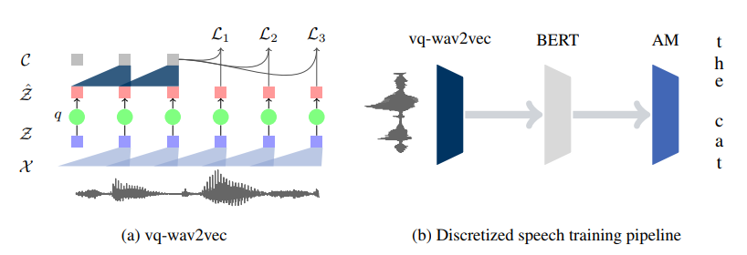
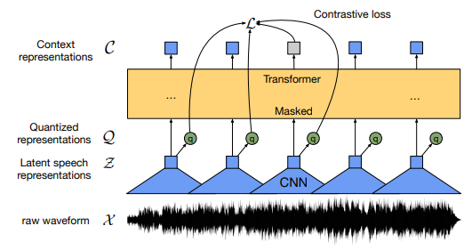

# Self-Supervised Approaches

## Notes
- Reduce features by using a pre- and post-processing network (map to embedding)
- Use a huge dataset for pretraining (e.g. Librispeech)
- USE MAE instead of MSE

###### Word2Vec

*Source: Mikolov et al., "Efficient Estimation of Word Representations in Vector Space", 2013, ICLR*

- In Word2Vec neighbouring words are predicted using a contrastive loss.
- Two approaches
  - Continuous bag-of-words (CBOW): model predicts the current word from a window of surrounding context words. The order of context words does not influence prediction (bag-of-words assumption).
  - Continous skip-gram: In the continuous skip-gram architecture, the model uses the current word to predict the surrounding window of context words. The skip-gram architecture weighs nearby context words more heavily than more distant context words
  - CBOW is faster while skip-gram does a better job for infrequent words

Take-aways:
- Large dataset (1.6B words)
- Simpler architecture (faster training) but more data
- Weight loss by distance (smaller loss if frame is further away)

###### Time Contrastive Learning
*Sources: Sermanet et al, "Time-contrastive networks: Self-supervised learning from multi-view observation", 2017, CVPRW* and *Hyvarinen and Morioka, "Unsupervised feature extraction by time-contrastive learning and nonlinear", 2016, NIPS*

Time Contrastive Networks which proposes to minimize distances between embeddings from multiple viewpoints of the same scene and whilst maximizing distances between embeddings extracted from different timesteps. In Time Contrastive
Learning a contrastive loss is used to predict the segment-ID of multivariate time-series as a way to extract features and perform nonlinear ICA.

- Time-contrastive learning (TCL) finds a representation which allows optimal discrimination of time segments (windows).
  - Divide signal into segments, assign each datapoint in the segment a segment-index, then learn to classify each datapoint to the segment index (learn to discriminate the segments)
- For videos: Positives are selected within a small window around anchors, while negatives are selected from distant timesteps in the same sequence -> Then apply a contrastive loss

Take-aways:
- Find features in time series that changes slower than the other (i.e. noise etc.)
- Contrastive loss by using feature vectors which are close together on the time axis as positive sample and vectors which are further apart as negative examples

###### Contrastive Predictive Coding (CPC)

*Source: van den Oord et al., "Representation Learning with Contrastive Predictive Coding", 2018*

> In this paper we propose the following: first, we compress high-dimensional data into a much more
compact latent embedding space in which conditional predictions are easier to model. Secondly, we
use powerful autoregressive models in this latent space to make predictions many steps in the future.
Finally, we rely on Noise-Contrastive Estimation for the loss function in similar ways that have
been used for learning word embeddings in natural language models, allowing for the whole model
to be trained end-to-end. We apply the resulting model, Contrastive Predictive Coding (CPC) to
widely different data modalities, images, speech, natural language and reinforcement learning, and
show that the same mechanism learns interesting high-level information on each of these domains,
outperforming other approaches.

      
       
      <i> Overview of Contrastive Predictive Coding, the proposed representation learning approach.
Although this figure shows audio as input, we use the same setup for images, text and reinforcement
learning.
</i>

- Universal unsupervised learning approach to extract useful representations from high-dimensional data, called Contrastive Predictive Coding
- Encode the underlying shared information between different parts of the (high-dimensional) signal, discard low-level information and noise that is more local
- Learn representations by predicting the future in latent space by using autoregressive models
  - First, an encoder maps the input sequence $$x_t$$ to latent representations $$z_t$$ with a lower temporal resolution, next an autoregressive model summarizes multiple latent representations $$z_{\leq t}$$ in a context latent representation $$c_t$$
  - Do not predict future observations with a generative model $$p(x_{t+k}|c_{t})$$ but model a density ratio which preserves the mutual information between $$x_{t+k}$$ and $$c_t$$: $$\frac{p(x_{t+k}|c_{t})}{p(x_{t+k}}$$ 

> One of the challenges of predicting high-dimensional data is that unimodal losses such as meansquared error and cross-entropy are not very useful, and powerful conditional generative models which
need to reconstruct every detail in the data are usually required. But these models are computationally
intense, and waste capacity at modeling the complex relationships in the data $$x$$, often ignoring the
context $$c$$. This suggests that modeling $$p(x|c)$$ directly may not be optimal for the purpose of extracting shared
information between $$x$$ and $$c$$. When predicting future information we instead encode the target $$x$$
(future) and context $$c$$ (present) into a compact distributed vector representations

- Also tested for speech recognition
  - Use raw signal, network consists of a CNN feature extractor and GRU RNN for the autoregressive part

Take-Away:
- Predicting "original" data is difficult, it is much easier to predict an embedding vector
- Two steps: Map input into latent space and then apply autoregressive model

###### Autoregressive Predictive Coding (APC)

*Source: Chung et al, "An Unsupervised Autoregressive Model for Speech Representation Learning", 2019* and *Chung et al., "Generative Pre-Training for Speech with Autoregressive Predictive Coding", 2020*

- Learn features which preserve information for a wide range of downstream tasks (do not remove noise and speaker variability but retain in the representations as much information about the original signal as possible)
  - Let the downstream task identify which features are helpful and which are not
- Autoregressive Predictive Coding (APC) -> Fed a frame into an RNN to predict one frame in the future
  - Used input: log Mel-Spectrograms
  - L1-Loss
- *Note: They solve a different task: The only predict one frame and then only use hidden embeddings for other downstream tasks.*

Take-away
- Try MAE instead of MSE as loss
- Try RNN network
  - Even though Transformer were found superior
- Only predict one frame ahead but multiple times (shift window)
  - Further away to learn more global structures instead of exploiting local smoothness
- Use large dataset for pretraining

###### Learning Speaker Representations with Mutual Information

*Source: Ravanelli and Bengio, "Learning Speaker Representations with Mutual Information", 2018*

      
       
      <i>Architecture of the proposed system for unsupervised learning of speaker representations. The speech chunks c_1 and c_2 are sampled from the same sentence, while c_rand is sampled from a different utterance.</i>

- Learn representations that capture speaker identities by maximizing the mutual information between the  encoded representations of chunks of speech randomly sampled  from the same sentence
  - Mutial information (MI): This measure is a fundamental quantity for estimating the statistical dependence between random variables.  As opposed to other metrics, such as correlation, MI can capture complex non-linear relationships between random variables
    - MI is difficult to compute directly. The aforementioned works found that it is possible to maximize or minimize the MI within a framework that closely resembles that of GANs
- Encoder relies on the SincNet architecture and transforms raw speech waveform into a compact feature vector
- Discriminator is fed by either positive samples (of the joint distribution of encoded chunks) or negative samples (from the product of the marginals) and is trained to separate them.
  - Is  fed by samples from the joint distribution (i.e. two local encoded vectors randomly drawn from the same speech sentence) and from the product of marginal distributions (i.e, two local encoder vectors coming different utterances). The  discriminator is jointly trained with the encoder to maximize the separability of the two distributions. 
- positive samples are simply derived by randomly sampling speech chunks from the same  sentence. Negative samples, instead, are obtained by randomly sampling from another utterance. The underlying assumptions considered here are the following: (1) two random utterances likely belong to different speakers, (2) each sentence contains a single speaker only.
- Differently to the GAN framework, the encoder and the discriminator are not adversarial here but must cooperate to maximize the discrepancy between the joint and the product of marginal distributions (max-max game instead of min-max game)
- The best results are obtained with end-to-end semi-supervised learning, where an ecosystem  of neural networks composed of an encoder, a discriminator,  and a speaker-id must cooperate to derive good speaker embeddings

###### wav2vec: Unsupervised Pre-Training for Speech Recognition

      
       
      <i>Illustration of pre-training from audio data X which is encoded with two convolutional
neural networks that are stacked on top of each other. The model is optimized to solve a next time
step prediction task.</i>

- Convolutional neural network optimized via a noise contrastive binary classification task
  - Input: Raw audio
  - Encoder networks embeds the audio signal in a latent space (i.e. convert raw audio to latent representations), context network combines multiple time-steps of the encoder to obtain contextualized representations (i.e. mix multiple latent representations to contextualized tensor with a given receptive field)
    - Important: use skip connections and (group) normalization
  - Contrastive loss that requires distinguishing a true future audio sample from distractor samples
- Mainly used for speech to text conversion: Therefore a lexicon as well as a seperate language model was used after a beam search decoder
- Uses the same loss function as word2vec
    
> Given an audio signal as input, we optimize our model to predict future samples from a given
signal context. A common problem with these approaches is the requirement to accurately model
the data distribution $$p(x)$$, which is challenging. We avoid this problem by first encoding raw speech
samples x into a feature representation z at a lower temporal frequency and then implicitly model a
density ratio $$p(z_{i+k}|z_{i} ... z_{i−r})/p(z_{i+k})$$ similar to [Representation learning with contrastive predictive coding]

k: number of steps in the future

###### wav2vec with Quantization

*Source: Baevski et al., "vq-wav2vec: Self-Supervised Learning of Discrete Speech Representations". 2019* and *Source: Baevski and Mohamed, "Effectiveness of Self-Supervised Pre-Training for ASR", 2020, ICASSP*

      
       
      <i>(a) The vq-wav2vec encoder maps raw audio (X) to a dense representation (Z) which
is quantized (q) to Zˆ and aggregated into context representations (C); training requires future time
step prediction. (b) Acoustic models are trained by quantizing the raw audio with vq-wav2vec,
then applying BERT to the discretized sequence and feeding the resulting representations into the
acoustic model to output transcriptions.
</i>

- Combine the two methods wav2veq and BERT to transform audio to text
- vq-wav2vec uses an additional quantization module (a CNN to build discrete representations) after calculating the dense representations and before aggregating them to context representations
  - More accurate with quantization module
- Fine-tune the pre-trained BERT models on transcribed speech using a Connectionist Temporal Classification (CTC) loss instead of feeding the representations into a task-specific model

###### wav2vec 2.0: A Framework for Self-Supervised Learning of Speech Representations

*Source: Baevski et al., "wav2vec 2.0: A Framework for Self-Supervised Learning of Speech Representations", 2020*

      
       
      <i>Illustration of the framework which jointly learns contextualized speech representations
and an inventory of discretized speech units.
</i>

- wav2vec 2.0 masks the speech input in the latent space and solves a contrastive task defined over a quantization of the latent representations which are jointly learned.
  - Input raw audio data in encoder (CNN) and then masks spans of the resulting latent speech representations.  The latent representations are fed to a Transformer network to build contextualized representations and the model is trained via a contrastive task where the true latent is to be distinguished
from distractors
  - Main difference to vq-wav2vec: Train End-to-End with one network  